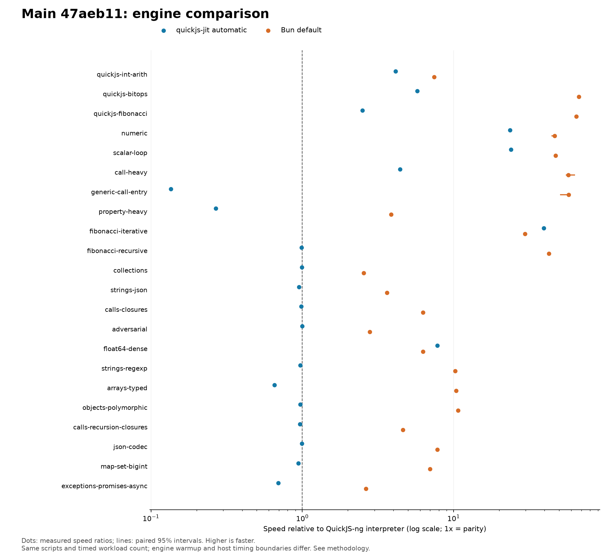

# main 47aeb11：QuickJS、quickjs-jit 与 Bun 横向比较

测量日期：2026-09-06。基线为合并 PR #19、#20 后的干净 `main`，完整提交 `47aeb11839a51ac9ae5d1d7c4b30c54ad3d3c3b7`。本轮不包含尚未合并的属性优化 `9ccda01`。

## 结论

在本协议下，自动 JIT 相对 QuickJS-ng 解释器：**8 项更快、1 项统计持平、13 项更慢**；相对 Bun 默认配置：**2 项更快、20 项更慢**。分类依据每项配对 95% 区间，不是只看点估计；22 个场景有相近或重复内核，不能把胜负数量当作应用覆盖率。

- 数值循环已有明显收益：`scalar-loop` 是解释器的 **24.024x** 速度，`fibonacci-iterative` 为 **39.448x**，`float64-dense` 为 **7.819x**。
- 本协议下，后两项分别是 Bun 的 **1.329x [1.305, 1.361]** 与 **1.246x [1.229, 1.261]** 速度。由于预热和宿主计时边界不同，这不是各引擎峰值性能的结论。
- 最大原生路径短板是 `generic-call-entry`：解释器的 **0.135x** 速度；以及 `property-heavy`：**0.268x**。属性场景虽有 Tier 2 记录，仍比 Tier 1 更慢。
- `arrays-typed` 自动模式仅为解释器的 **0.656x** 速度，强制 Tier 2 为 **1.668x**。这支持调查自动分层与实际执行路径；单凭累计 Tier 2 记录不能证明计时段一直执行 Tier 2。
- `exceptions-promises-async` 全部自动样本均无原生入口，仍只有解释器的 **0.693x** 速度；`map-set-bigint` 同样无原生入口，为 **0.944x**。回退成本应与原生路径效率分别优化。
- `adversarial` 统计持平，区间是比解释器 **慢 0.90% 至快 1.22%**。其余小幅落后项应与上述大幅落后项区别排序。

建议执行顺序见 [下一阶段性能目标](../../docs/PERFORMANCE_NEXT.md)：先修测量协议与计数器，再处理属性、调用、自动分层/回退，最后以独立冷启动及库函数剖析扩展目标。

## 三方延迟与速度

延迟单位为 **毫秒/10 次 workload 调用的计时批次**，不是单次调用延迟。速度 = 基线延迟 / 被比较引擎延迟；高于 1x 更快，低于 1x 更慢。方括号为配对 95% 区间。QuickJS 指本仓库固定版本的 QuickJS-ng，JIT 指 automatic，Bun 为默认配置。

| 场景 | QuickJS ms | JIT ms | Bun ms | JIT / QuickJS 速度 [95%] | JIT / Bun 速度 [95%] | JIT 相对 QuickJS |
|---|---:|---:|---:|---|---|---|
| quickjs-int-arith | 6.8045 | 1.6478 | 0.9142 | 4.129x [4.078, 4.147] | 0.555x [0.552, 0.559] | 更快 |
| quickjs-bitops | 1.2027 | 0.2090 | 0.0179 | 5.753x [5.735, 5.800] | 0.086x [0.085, 0.086] | 更快 |
| quickjs-fibonacci | 0.9308 | 0.3721 | 0.0143 | 2.501x [2.481, 2.569] | 0.039x [0.038, 0.040] | 更快 |
| numeric | 0.6200 | 0.0263 | 0.0133 | 23.581x [23.293, 24.160] | 0.506x [0.501, 0.529] | 更快 |
| scalar-loop | 0.6319 | 0.0263 | 0.0134 | 24.024x [23.382, 24.316] | 0.508x [0.504, 0.520] | 更快 |
| call-heavy | 1.3983 | 0.3162 | 0.0243 | 4.422x [4.392, 4.460] | 0.077x [0.070, 0.080] | 更快 |
| generic-call-entry | 1.0784 | 7.9852 | 0.0186 | 0.135x [0.134, 0.136] | 0.002x [0.002, 0.003] | 更慢 |
| property-heavy | 1.3814 | 5.1528 | 0.3567 | 0.268x [0.267, 0.271] | 0.069x [0.069, 0.070] | 更慢 |
| fibonacci-iterative | 33.8036 | 0.8569 | 1.1388 | 39.448x [38.684, 40.356] | 1.329x [1.305, 1.361] | 更快 |
| fibonacci-recursive | 12.0757 | 12.2149 | 0.2824 | 0.989x [0.984, 0.993] | 0.023x [0.023, 0.024] | 更慢 |
| collections | 1.7849 | 1.7973 | 0.7020 | 0.993x [0.988, 0.998] | 0.391x [0.388, 0.394] | 更慢 |
| strings-json | 2.1580 | 2.2679 | 0.5935 | 0.952x [0.949, 0.954] | 0.262x [0.261, 0.264] | 更慢 |
| calls-closures | 3.5944 | 3.6513 | 0.5733 | 0.984x [0.983, 0.987] | 0.157x [0.156, 0.158] | 更慢 |
| adversarial | 1.0617 | 1.0624 | 0.3792 | 0.999x [0.991, 1.012] | 0.357x [0.351, 0.362] | 统计持平：慢 0.90% 至快 1.22% |
| float64-dense | 2.9079 | 0.3719 | 0.4635 | 7.819x [7.708, 7.895] | 1.246x [1.229, 1.261] | 更快 |
| strings-regexp | 19.3842 | 19.9433 | 1.8874 | 0.972x [0.971, 0.974] | 0.095x [0.094, 0.095] | 更慢 |
| arrays-typed | 4.5986 | 7.0111 | 0.4417 | 0.656x [0.654, 0.658] | 0.063x [0.062, 0.064] | 更慢 |
| objects-polymorphic | 6.5235 | 6.7252 | 0.6081 | 0.970x [0.966, 0.973] | 0.090x [0.090, 0.091] | 更慢 |
| calls-recursion-closures | 7.4095 | 7.6641 | 1.6019 | 0.967x [0.964, 0.970] | 0.209x [0.208, 0.210] | 更慢 |
| json-codec | 78.4781 | 78.9305 | 10.0503 | 0.994x [0.990, 0.997] | 0.127x [0.127, 0.128] | 更慢 |
| map-set-bigint | 15.4696 | 16.3837 | 2.2103 | 0.944x [0.941, 0.947] | 0.135x [0.134, 0.136] | 更慢 |
| exceptions-promises-async | 1.9750 | 2.8484 | 0.7497 | 0.693x [0.690, 0.697] | 0.263x [0.261, 0.267] | 更慢 |

## 分层诊断

下表也保留回退样本的实测速度。`native` / `Tier 2` 是 30 个自动样本中有相应累计入口记录的样本数，**包含预热**，不表示计时段覆盖率。强制模式表示请求的策略，不保证每个场景实际进入该层；逐样本证据见原始 JSON，标准门槛报告会隐藏无相应原生入口的成绩。

| 场景 | Tier 1 / QuickJS 速度 | 请求 Tier 2 / QuickJS 速度 | 自动 native 样本 | 自动 Tier 2 样本 |
|---|---:|---:|---:|---:|
| quickjs-int-arith | 2.581x | 4.129x | 30/30 | 30/30 |
| quickjs-bitops | 2.820x | 5.735x | 30/30 | 30/30 |
| quickjs-fibonacci | 2.567x | 2.513x | 30/30 | 0/30 |
| numeric | 2.913x | 23.761x | 30/30 | 30/30 |
| scalar-loop | 2.970x | 24.142x | 30/30 | 30/30 |
| call-heavy | 2.949x | 4.428x | 30/30 | 30/30 |
| generic-call-entry | 0.124x | 0.141x | 30/30 | 0/30 |
| property-heavy | 0.446x | 0.268x | 30/30 | 30/30 |
| fibonacci-iterative | 4.461x | 40.003x | 30/30 | 30/30 |
| fibonacci-recursive | 0.118x | 0.987x | 0/30 | 0/30 |
| collections | 0.995x | 0.996x | 0/30 | 0/30 |
| strings-json | 0.488x | 0.976x | 30/30 | 0/30 |
| calls-closures | 0.982x | 0.983x | 0/30 | 0/30 |
| adversarial | 1.376x | 1.003x | 30/30 | 0/30 |
| float64-dense | 1.779x | 7.694x | 30/30 | 30/30 |
| strings-regexp | 0.863x | 0.972x | 30/30 | 0/30 |
| arrays-typed | 0.300x | 1.668x | 30/30 | 30/30 |
| objects-polymorphic | 0.283x | 0.973x | 30/30 | 0/30 |
| calls-recursion-closures | 0.077x | 0.200x | 0/30 | 0/30 |
| json-codec | 0.827x | 0.990x | 30/30 | 0/30 |
| map-set-bigint | 0.946x | 1.025x | 0/30 | 0/30 |
| exceptions-promises-async | 0.692x | 0.565x | 0/30 | 0/30 |

## 方法与限制

- 环境：Linux x86_64，Intel i7-13700KF，固定 CPU 0，电源模式 `powersave`；Rust 1.98.0 release 构建。具体内核、工具链及文件哈希保存在原始数据和方法记录中。这是单机单轮结果。
- QuickJS 基线是仓库固定的 QuickJS-ng `fd0a0210b7be00957751871e7e01b8291268fc29`，与 JIT 使用同一 Rust benchmark 可执行文件，但不挂载 JIT backend；不是独立上游 `qjs` CLI，JIT ABI 补丁仍被编译。
- Bun 1.4.0 使用默认引擎配置。仓库 runner 原本添加 `--smol`，本轮通过 `JIT_BENCH_BUN` 指定的临时 launcher 仅去掉该参数。launcher 源码、环境变量、命令和实际 Bun 哈希均已归档；不要仅根据标准报告的 argv 推断 Bun flags。
- 22 场景 × 5 模式，每项 5 个丢弃预热进程、30 个交错配对新进程延迟样本、10 个一秒吞吐窗口。共核对 3,300 个延迟样本；每场景跨模式结果校验值相同，入口/出口与层级计数一致，源码干净且二进制哈希匹配。
- 预热不等价：QuickJS JIT 等待自适应 readiness/编译稳定，Bun 仅执行一次未计时调用后计时 10 次。外层丢弃的 5 个进程不会把 JIT 状态带到新进程。本轮是当前协议的比较，不能称为充分等量预热后的峰值吞吐。
- 计时边界不等价：QuickJS 循环还包含 Rust 侧 workload 查找/调用、结果转换/校验值格式化、JIT polling；Bun 在计时后计算校验值。QuickJS 与自动 JIT 共享 Rust 边界，对 Bun 的比值包含宿主差异。
- 报告使用 30 样本的上中位数（排序后第 16 个，与 runner 相同），速度是两组中位数之比。CI 使用同一 pair_index 联合重采样 10,000 次，seed=20260906，取上中位数之比及向上取整秩的 2.5/97.5 百分位。这与标准门槛报告的几何平均统计量不同。区间未做多重比较校正，不能覆盖跨机器/跨时段不确定性。
- 原始吞吐是每秒完成的新 worker 数，包含创建、预热及编排，不是 JS ops/s。Bun total 在父进程计时，QuickJS total 在 worker 内计时；不可当作同边界的三方启动速度。
- 无原生路径的 Map/Set/BigInt 与异常/异步，自动模式 readiness 阶段中位数分别约 2,005.63 ms、3,000.40 ms。这是 benchmark 等待/稳定协议的成本，不能宣称引擎启动必然需要 2–3 秒；报告的计时批次已排除该阶段，但历史状态可能受它影响。
- `numeric` 与 `scalar-loop` 是相近内核。未包含 SunSpider、JetStream 或实际应用，不用跨所有场景的一个几何平均宣称整体优于其他引擎。

## 验收门槛

完整运行结束，runner 返回 2：**门槛未全部通过，非采样中断**。[生成报告](main-47aeb11-gates.md) 保留原始输出。以下将延迟比转换为速度方向说明：

- 强制 Tier 2 / 解释器的 compute 几何平均速度区间 **3.87x–3.90x**，未达到下界 5x；至少一个指定内核达到 10x 的门槛通过。这两个门槛不比较 automatic 或 Bun。
- 严格样本所需原生层级、所有样本校验值门槛通过。
- 自动 profitability 决策证据门槛失败（missing decision）；这不等于没有配置自动模式，也不能据此直接认定所有未编译函数都是策略 bug。
- 自动 / 解释器 startup 聚合速度区间 **0.415x–0.420x**；definition-eval 代理 **0.886x–0.905x**，均未达原延迟上限 1.05 的门槛。原门槛等价于速度下界至少 **1/1.05 ≈ 0.95238x**。startup 是 runtime 创建、JIT attach、context 创建、首次 eval 之和，不含 readiness 等待；definition-eval 代理不是真实应用热重载。
- P99 聚合速度区间 **1.696x–1.800x** 达到该门槛，但每场景仅 30 个进程样本，P99 接近样本最大值，仍需独立尾延迟测量；聚合通过也不能掩盖单项明显落后。
- gpui-shell 门槛为 **INCONCLUSIVE**：当前 reporter 固定标记未提供外部宿主证据，不是本轮观察到的应用性能失败。

## 原始证据与复现

- [原始全部样本](main-47aeb11-engines.json)、[方法与 launcher](main-47aeb11-methodology.json)、[派生结果及区间](main-47aeb11-summary.json)、[CSV](main-47aeb11-engines.csv)。
- [SVG 图](main-47aeb11-engines.svg)、[标准门槛报告](main-47aeb11-gates.md)。
- 原始 JSON SHA-256：`befaf0b83e72d330e0f8573850b1f9830b728e3fe5e8ee04f102c0c3cfa1e301`。

在干净 `47aeb11` 上 release 构建，按方法记录创建可执行 launcher，执行其记录的 `JIT_BENCH_BUN=... taskset -c 0 ... compare --modes interpreter,tier1,tier2,automatic,bun` 命令。输出放在仓库外，待采样及 provenance 写出后再归档；重跑时核对 Bun、runner、脚本与 schema 哈希。未来若改变预热/计时协议，必须重建主分支三方基线，不能把新旧协议数据直接拼接。
